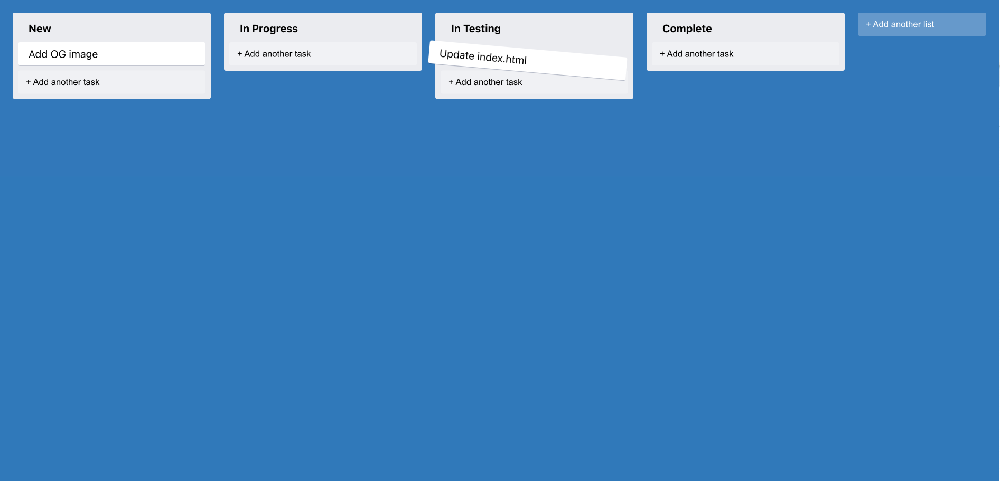

# Trello Clone

This project was built with TypeScript React and deployed to Render on URL [https://trello-clone-h1fj.onrender.com/](https://trello-clone-h1fj.onrender.com/ "Trello Clone")

## Description

This is a simple Trello clone built with React TypeScript that resembles a Kanban board where user can setup columns with tasks inside and then drag & drop a task inside a different column depending on it's status.

